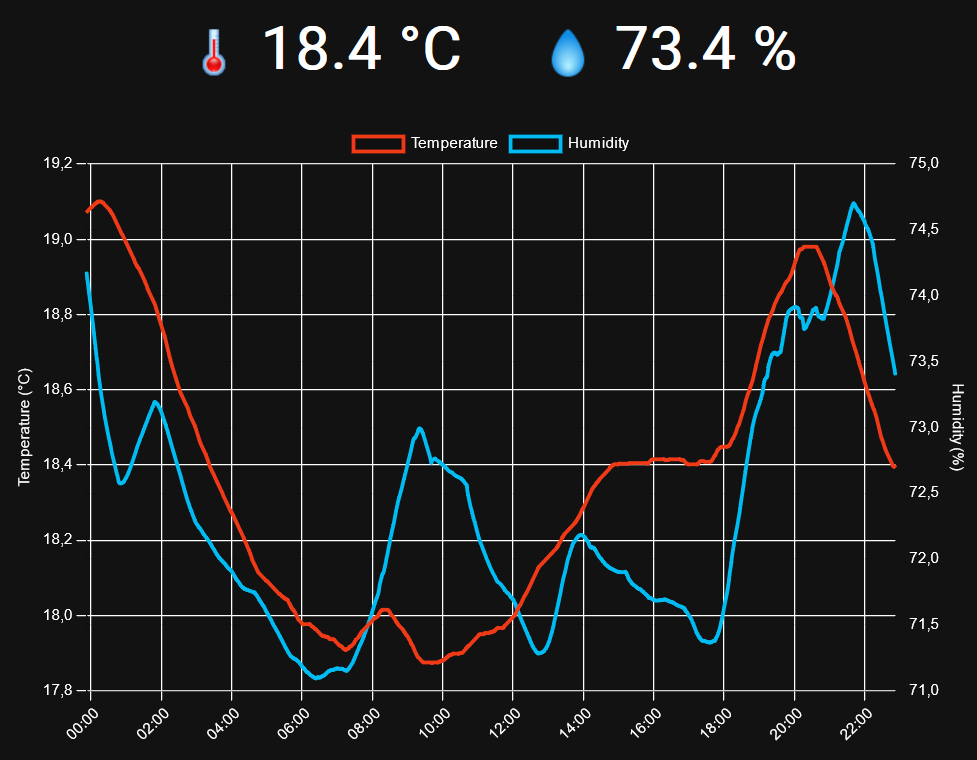

# InfluxDB Dashboard

A simple dashboard to display a graph of temperature and humidity.



## Use case

I have a DHT22 sensor connected to my Rasberry Pi and and I send the data to InfluxDB every minute.
I wanted to display the temperature graph on an old tablet running Android 4 and couldn't use Grafana
because the Chrome version on my tablet didn't support it.

## Setup

You need an InfluxDB bucket with the humidity and temperature data in two separate measurements.

Copy the `.env.example` file to `.env` and edit the variables with your InfluxDB server URL and credentials.

```sh
copy .env.example .env
```

## Developing

Once you've created a project and installed dependencies with `npm install`, start a development server:

```sh
npm run dev
```

## Building

To create a production version of the app:

```sh
npm run build
```

Or with docker:

```sh
docker build -t influxdb-dashboard .
```

You can preview the production build with `npm run preview`.

## Running

After the app is built, run it with Docker:

```sh
docker run -d -p 3000:3000 influxdb-dashboard
```

The dashboard will be accessible on http://localhost:3000.
